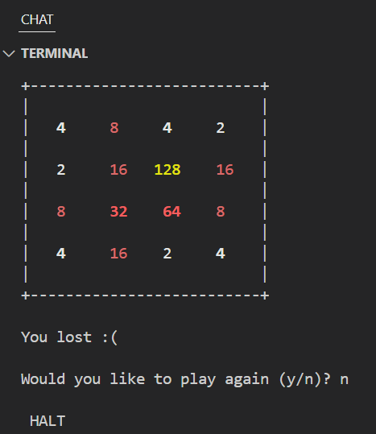

# LC3 Virtual Machine Project

In this project I attempt to learn how virtual machines work and learn more about LC3. My goal is to become proficient in C programming, learn more about how CPUs work, learn how compilers work and overall become a better low level developer.

I will be building a total of 2 virtual machines, when I say virtual machines I mean ISA emulators. There are 2 ISAs that I would try to make VMs for, they are listed as follows:
- Little Computer 3 (Currently working on)
- RISC V

## Current Status

- LC3 Virtual Machine: Fully implemented and functional
- LC3 Assembler: Currently implementing second pass

## Architecture Overview

The LC3 virtual machine implements a complete instruction set architecture emulator. The implementation uses a centralized state structure that holds all CPU state including registers, the current instruction, decoded operands, and execution flags. This design pattern was inspired by the y86 CPU implementation from UBC CPSC 313.

### Register Architecture

The LC3 provides 10 registers:
- **R0-R7**: General-purpose registers (R0 is hardwired to zero)
- **PC**: Program Counter (16-bit, initialized to 0x3000)
- **COND**: Condition Code register with three flags:
  - POS (Positive): Set when result > 0
  - ZRO (Zero): Set when result = 0
  - NEG (Negative): Set when result < 0 (bit 15 set)

### Instruction Set

The LC3 implements 16 instruction types:

**Arithmetic and Logic:**
- ADD: Addition (register or immediate)
- AND: Bitwise AND (register or immediate)
- NOT: Bitwise NOT

**Memory Operations:**
- LD: Load from memory using PC-relative addressing
- LDI: Load indirect (double indirection)
- LDR: Load register (base + offset)
- ST: Store to memory using PC-relative addressing
- STI: Store indirect
- STR: Store register (base + offset)
- LEA: Load effective address

**Control Flow:**
- BR: Conditional branch (supports N, Z, P condition flags)
- JMP: Jump to address in register (RET when using R7)
- JSR: Jump to subroutine (PC-relative or register-based)
- RTI: Return from interrupt (unused in this implementation)

**System:**
- TRAP: Execute trap routine (6 routines implemented)
- RES: Reserved opcode (unused)

### Trap Routines

The VM implements 6 trap routines for I/O operations:
- TRAP_GETC (0x20): Get character from keyboard (not echoed)
- TRAP_OUT (0x21): Output character to terminal
- TRAP_PUTS (0x22): Output null-terminated string
- TRAP_IN (0x23): Get character from keyboard (echoed)
- TRAP_PUTSP (0x24): Output byte string (two characters per word)
- TRAP_HALT (0x25): Halt program execution

### Memory System

- **Addressable Space**: 64KB (65,536 bytes, 32,768 words)
- **Word Size**: 16 bits
- **Byte Ordering**: Big-endian (bytes are swapped when reading/writing object files)
- **Memory Layout**:
  - Addresses below 0x3000: Reserved for trap routines
  - 0x3000: Default program start address
  - 0xFE00 (KBSR): Keyboard status register (memory-mapped I/O)
  - 0xFE02 (KBDR): Keyboard data register (memory-mapped I/O)

### Instruction Execution

The VM follows a fetch-decode-execute cycle:

1. **Fetch**: Load 16-bit instruction from memory at PC
2. **Decode**: Extract opcode (bits 15-12) and operands using bit manipulation macros
3. **Execute**: Perform operation, update registers/memory
4. **Update State**: Set condition codes, update PC, check for halt condition

Instruction decoding uses macros for extracting fields:
- `get_op()`: Extract opcode
- `dr()`, `sr1()`, `sr2()`: Extract register operands
- `pc_offset()`, `pcoffset11()`, `offset6()`: Extract signed offsets with sign extension
- `imm5()`: Extract 5-bit immediate with sign extension
- `SIGN_EXTEND()`: Macro for sign extending values

## How to Run

### Prerequisites

- GCC compiler (or compatible C compiler)
- Windows operating system (current implementation uses Windows-specific APIs for input handling)
- Make utility (optional, for using Makefile)

### Building the Virtual Machine

Navigate to the LC3 directory and compile:

```bash
cd LC3
gcc -o lc3 LC3.c
```

Or use the Makefile:

```bash
cd LC3
make run
```

### Running Programs

The virtual machine executes LC3 object files (`.obj` format). You can run a program by passing the object file as an argument:

```bash
./lc3 <program.obj>
```

You can also load multiple object files:

```bash
./lc3 program1.obj program2.obj
```

### Running Example Programs

The project includes several example programs:

**Hello World**
```bash
cd LC3
gcc -o lc3 LC3.c
./lc3 helloworld.obj
```

**2048 Game**
```bash
cd LC3
gcc -o lc3 LC3.c
./lc3 2048.obj
```



**Additional Examples**
- `revstring.obj` - String reversal program
- Assembly source files: `charcount.asm`, `mul10.asm`, `population.asm`, `revstring.asm`

### Building and Using the Assembler

The assembler is currently implementing a two-pass design. To compile:

```bash
cd LC3
gcc -o lc3assembler LC3assembler.c
```

To assemble a program:

```bash
./lc3assembler <program.asm>
```

This will generate a `.obj` file that can be executed by the virtual machine.

## Implementation Details

### State Machine Design

The implementation uses a centralized `LC3` struct that holds:
- Register array (8 general-purpose registers)
- Program Counter and Condition Code register
- Current instruction and decoded fields (opcode, destination register, source registers, immediate values, PC offsets)
- Running flag to control execution loop

This design simplifies instruction decoding and state management. All instruction fields are extracted and stored in the struct immediately after fetching, making the execution logic cleaner. The trade-off is that you need to reference `cpu.field` throughout the code, but it keeps everything organized in one place.

### Input/Output Handling

The VM uses Windows-specific APIs for real-time keyboard input:
- `disable_input_buffering()`: Configures console for character-by-character input
- `check_key()`: Non-blocking keyboard check using `_kbhit()`
- `restore_input_buffering()`: Restores normal console mode on exit

Memory-mapped I/O is implemented for keyboard interrupts:
- Reading from KBSR (0xFE00) checks for keyboard input
- If a key is pressed, KBSR bit 15 is set and the character is stored in KBDR (0xFE02)

### Object File Format

LC3 object files use a simple format:
1. First word: Origin address (where to load the program)
2. Subsequent words: Program instructions/data in big-endian format

The VM performs byte swapping when reading object files to handle endianness conversion.

### Assembler Implementation

The assembler is implementing a two-pass design:

**First Pass:**
- Builds symbol table by scanning for labels and directives
- Calculates addresses for all symbols
- Handles directives: `.ORIG`, `.FILL`, `.BLKW`, `.STRINGZ`, `.END`

**Second Pass:**
- Generates instruction encodings using symbol table
- Resolves forward references
- Outputs object file in LC3 format

The assembler supports:
- All 16 LC3 instructions
- Label definitions and references
- Assembly directives (`.ORIG`, `.FILL`, `.BLKW`, `.STRINGZ`, `.END`)
- Comments (lines starting with `;` or `;;`)

## Project Structure

```
.
├── LC3/                      # Main implementation directory
│   ├── LC3.c                # Virtual machine implementation
│   ├── LC3.h                # Header file with definitions and macros
│   ├── LC3assembler.c       # Assembler implementation (two-pass)
│   ├── LC3assembler.h       # Assembler header with instruction names
│   ├── Makefile             # Build configuration
│   ├── *.obj                # Example object files
│   └── *.asm                # Example assembly source files
├── Docs/                     # Documentation
│   ├── Design Document.md   # Detailed design decisions
│   ├── ISA explanation.md    # LC3 instruction set reference
│   └── image.png            # Screenshots
└── README.md                # This file
```

## References

- [Write your own VM](https://www.jmeiners.com/lc3-vm/) by Justin Meiners and Ryan Pendleton
- [LC3 ISA description](https://www.jmeiners.com/lc3-vm/supplies/lc3-isa.pdf)
- [Assembler tutorial](https://www.youtube.com/watch?v=rdKX9hzA2lU)
- [Assemblers and Loaders](https://www.davidsalomon.name/assem.advertis/AssemAd.html)
